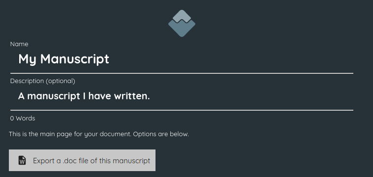

:doctype: book
:toc:
:toclevels: 1

= Backup, import and export

== Backup to Google Drive

[sidebar]
****
@Iain: None of the following has been tested as I get an error when trying to connect my Google Drive account.
See the note in xref:navigation.adoc#google-drive[]
****

Wavemaker has native support for Google Drive backups.
There are three ways you can use Google Drive to keep your work backed up and secure:

. Set Wavemaker to automatically sync your work to Drive as you write.
You will be prompted to enable this feature each time you load Wavemaker.
+
[sidebar]
****
@Iain: Is this still the case?
****

. You can manually sync to Google Drive whenever you choose.
Use the Google Drive icon in the menu bar (image:../images/google-drive-icon.png[Google Drive,width=20,height=20]) to initiate a backup.

. Use the <<Export to file>> instructions below to export your work, then save that file in a location backed up by Google Drive.

== Load a file from Google Drive

include::getting-started.adoc[tag=import-from-drive]

== Save file

include::navigation.adoc[tag=export-to-device]

== Load a file from your Device

include::getting-started.adoc[tag=import-from-device]

== Import a Wavemaker Version 3 file

include::getting-started.adoc[tag=import-wm-v3]

== Export a .doc file of this manuscript

This option, found on the main page of your manuscript, will export a `.doc` version of your work.

After clicking this button you will be prompted to name your exported file (be careful not to overwrite the `.doc` extension) and choose where on your local device to save it.