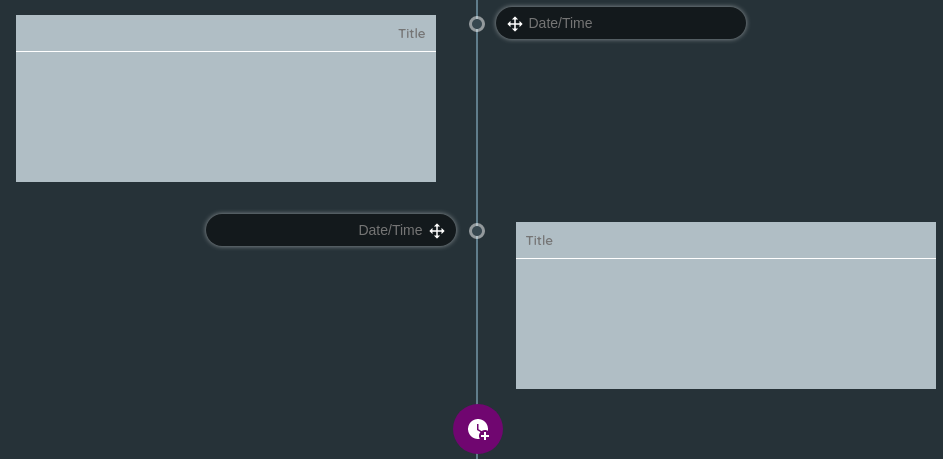
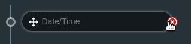
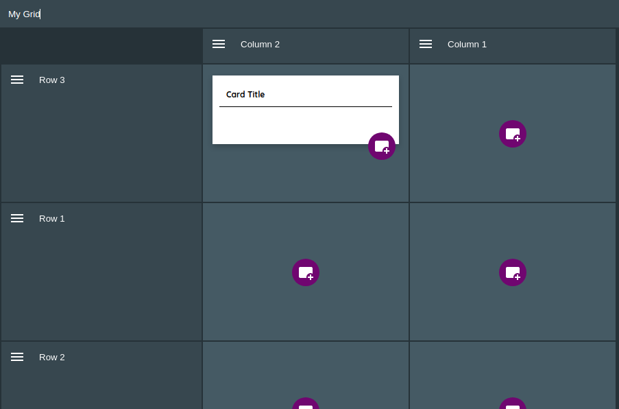

:doctype: book
:toc:
:toclevels: 1

= Features

Wavemaker includes various tools intended to make planning and writing your novel as easy as possible.

There is no _correct_ way to use Wavemaker.
It is intended to be used the way *you* want to use it.

While some of the writing tools listed below do work together, you may prefer to just use one or two of them independently.

[#writer]
== image:../images/manuscript-icon.png[Writer tool,24] Writer

The Writer tool is the text editor/word processor built into Wavemaker.

At the top of the writing pane is a menu bar similar to that found in commercial word-processors:

image::../images/writer-bar.png[Writer bar,500]

From left to right, the icons on this bar are:

. *Bold* text formatting.
. _Italic_ text formatting.
. [.line-through]#Strikethrough# text formatting.
. [.underline]##@Iain: This doesn't appear to do anything.##
. Top-level heading.
. Subheading.
. Insert image.
. Bulleted list.
. Numbered list.
. <<#planning-boards,Planning board>> link.
. <<#typewriter-mode,Typewriter mode>>
. <<#highlighter-mode,Highlighter mode>>
. Exclude from the manuscript's word count.

A sidebar to the left shows the sections (or chapters) of your manuscript.
This sidebar is discussed in more detail in the <<Sidebars>> section.

A sidebar to the right of the page allows you to create reference <<cards,cards>> and attach them to the page you are working on.
These cards are discussed below.

Both sidebars can be pinned open for easy access or unpinned for a larger editing page.

=== Sidebars

Within this sidebar you can create new sections by clicking on one of the two icons at the top of the sidebar.
A new section can either be a _child_ () or _sibling_ () to the section currently open in the Writer.
Child sections are nested below the parent section while sibling sections are on the same level.

You can reorder the sections by dragging the section icon to the desired location.
You can also delete sections by clicking on the `x` icon that becomes visible to the right of any section when you hover your cursor over it.

You can pin sidebars open with the pin icons at the top left and top right of the writer page.

The left sidebar contains links to the various pages in your manuscript.
The right sidebar is a Card manager.
It allows you to create Cards for, or link existing Cards to, this page.

[#typewriter-mode]
=== image:../images/typewriter-icon.png[Typewriter mode,24] Typewriter mode

Typewriter mode is accessed through the Writer tool.
Click the 'typewriter' icon in the top bar to enter Typewriter mode.

This mode aims to help you concentrate on your writing by removing as much of the Wavemaker UI as is practical.
All that remains visible is the Writer formatting bar.

While in Typewriter mode, your text is centred in the window and the font is changed to a typewriter-like style.

As you type, the text automatically rises so that your cursor, and your current work, are at a comfortable eye level.
Lines are double-spaced automatically.

Exit Typewriter mode by clicking on the `x` icon in the top right.

[#highlighter-mode]
=== image:../images/highlighter-mode-icon.png[Typewriter mode,24] Highlighter mode

Clicking the 'highlighter' icon in the Writer's main menu bar will reveal a palette of seven colours.

You can click on a colour from this palette and any text you type will be highlighted in that colour.

Alternatively, you can highlight existing text by selecting it and then clicking one of the highlight colours.

[sidebar]
****
@Iain: Some thoughts regarding the highlighter implementation:

. There's no visual indicator on the palette to show which, if any, highlighter is currently in use.
Sure, typing will reveal that, but that could require unnecessary keystrokes to see which highlighter is active.

. The positioning of the colour palette often triggers the Cards sidebar if it is in 'hide' mode.

. Unhighlighting requires carefully selecting the highlighted text and clicking the active colour button (see #1 above).
If the selection is not perfect, not only will the text not be returned to normal, any additional text will become highlighted.
Perhaps a 'white' colour option could be added, or just an 'unhighlight' button?
****

[#cards]
==  Cards database

Cards are a powerful tool that allows pertinent text or visual details to be readily available when you need them.

Cards tie many of Wavemaker's tools together.
Cards can be created man different parts of Wavemaker (the <<#writer,Writer>> sidebar or the <<#grid-planner,Grid Planner>>, for example)
All the cards you create will be stored in the Cards database.
Cards created in one part of the software can appear in other parts of the software.

They can be coloured and tagged to assist with sorting and identification.

The image below shows the card interface:

image::../images/new-card.png[New card,400]

[sidebar]
****
TODO: Put callouts on this image.
****

[#planning-boards]
==  Planning boards

Planning boards allow you to create a grid of cards that may assist you with planning out the events in your novel.
Each column in the grid corresponds to a section in your manuscript.
The cells in each column are the cards attached to that section.

To create a new board from the home page, click on the _Planning boards_ entry and then click on the document icon at the top right.
To create a new board from within Wavemaker, click the  _Planning boards_ icon in the top bar.

The board works in conjunction with the writer; you can create cards in the Writer sidebar that will automatically populate a corresponding column in the associated planning board.

Likewise, you can create a Planning board full of detailed cards and Wavemaker will automatically create matching sections in the Writer tool.
Each column in the board becomes linked to a section with the same title.
Any notes in the column will be automatically attached to the sidebar of the corresponding section.

From the Writer sidebar, you can use the pop-out button to open the grid planner in a new window, allowing you ease of reference without cluttering the Writer interface.

[#mindmaps]
==  Mindmaps

The Mindmap tool helps you visualise how the various concepts in your novel interconnect.

To create a new mindmap from the home page, select the _Your Mindmaps_ entry and then click the mindmap icon at the top right.

To create a new mindmap from within Wavemaker, click the _Mindmaps Tool_ icon in the top bar.

Once in a mindmap, use the icons to the top left to create new nodes, either image or text, and the style of link between them.

To move a node around within the mindmap, select it and drag using the directional icon at the right of the node.

To link two nodes together, select one of the nodes you want to link and then click on the _chain_ icon at the bottom right of the node.
Do the same to the other node you want to link.
A line, in your selected style, will appear between the two nodes.
Either of the linked nodes can now be moved freely around the mindmap space and the link will be maintained.

Remove links by clicking on them.
They will turn red if you hover your cursor over them and will disappear when clicked.

Add concepts and ideas, images and explanations as you need and let the tool help you visualise how they relate to each other.

[#snowflakes]
==  Snowflakes

The _Snowflake method_ was devised by an author by the name of https://www.ingermanson.com/[Randy Ingermanson].
The snowflake method gradually adds details and complexity to a simple summary until a complete novel is formed.

To create a new snowflake from the home page, select the _Your Snowflakes_ entry and then click the snowflake icon at the top right.

To create a new snowflake from within Wavemaker, click the _Snowflake Tool_ icon in the top bar.

To use the Snowflake tool, type a title and a short concept or summary into the blank card.
Once you have the summary worded to your liking, click the _stacked boxes_ icon to the right of the card.
If you do not want the card anymore you can delete it by clicking the _trashcan_ icon at the top right.

Clicking the _stacked boxes_ icon will present three more cards, stacked to the right of the original card.
Clicking on the _stacked boxes_ icon again will remove the new cards, leaving your original card untouched.

To move forward, break your summary down into a beginning, middle and end (typing them into the appropriate boxes).

Once you have expanded your summary this way, you can click the arrows icon (which takes the place of the box icon).
You will be prompted that this action will replace your original card.
Click [OK] or [Cancel] as you choose.

If you click [OK], your original card will disappear replaced by the three new cards.
Each of these will now have a _stacked boxes_ icon attached.

Repeat the process, expanding each card as you can, until you have a detailed synopsis of your novel.

[#timelies]
==  Timelines

The timeline tool allows you to organise the events of your story around a vertical axis that represents the linear chronology.

The events are created in entry cards (these are different to the <<Cards>> feature) that hang on the timeline.
Each entry has a clear space for a time and date, as well as a title and description.

New cards can be added by clicking on the button highlighted in the image below.
Each new card will alternate its orientation from the one above.

Cards can also be moved up and down the timeline by dragging the directional cross in the `Date/Time` field.
You can delete a card by clicking on the `x` icon that appears when you hover over the `Date/Time` field.

This tool is connected to the Writer tool; click the export button at the top right of the tool and your timeline events will be imported into the Writer as separate pages.

[#grid-planner]
==  Grid planner

The Grid Planner is another way to organise your thoughts when writing your manuscript.

The tool lets you create a grid of ideas, images, reminders, events or anything else you might need.

Use the buttons at the top right of the tool to create rows and columns as needed: 

The axes on the grid can represent whatever you need them to.
They are completely arbitrary.

You can name the columns and rows individually and drag them around using the 'hamburger' icons in the top left of each.

To populate the cells in the grid, click on the icon in the centre and choose to either create a new card or link an existing card.
These cards will be added to the <<Cards>> database along with any other cards you have created in other tools within the software.
