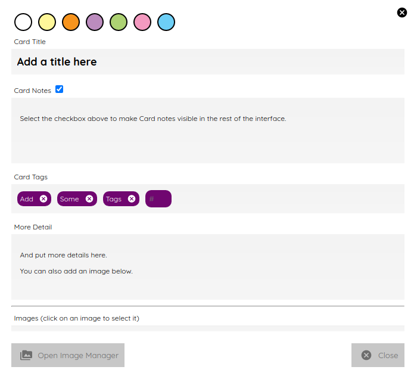

- [Features](#features)
  - [ Writer](#-writer)
  - [Focus mode](#focus-mode)
  - [Cards](#cards)
  - [Planning boards](#planning-boards)
  - [ Mindmaps](#-mindmaps)
  - [Snowflakes](#snowflakes)
  - [Grid planner](#grid-planner)
  - [Timelines](#timelines)
  - [Search](#search)

# Features

Wavemaker includes various tools intended to make planning and writing your novel as easy as possible.

There is no _correct_ way to use Wavemaker.
It is intended to be used the way **you** want to use it.

While some of the writing tools listed below do work together, you may prefer to just use one or two of them independently.

##  Writer

The Writer tool is the text editor/word processor built into Wavemaker.

It includes **bold**, _italic_ and ~~strikethrough~~ text formatting.
It supports inserting headings and subheadings, images, bulleted and numbered lists and quotes.
It also includes a link to the [Grid Planner](#grid-planner) and a [focus mode](#focus-mode).

A sidebar to the left shows the sections (or chapters) of your manuscript.
This sidebar is discussed in more detail in the [Navigation](navigation.md) section.

A sidebar to the right of the page allows you to create reference [cards](#cards) and attach them to the page you are working on.
These cards are discussed below.

Both sidebars can be pinned open for easy access or unpinned for a larger editing page.

## Focus mode

## Cards

Cards are a powerful tool that allows pertinent textual or visual details to be readily available when you need them.

Cards tie many of Wavemaker's tools together.
Cards created in one part of the software (the Writer sidebar, for example) appear in other parts of the software (such as the Grid Planner).

They can be coloured and tagged to assist with sorting and identification.

The image below shows the new card interface:

## Planning boards

Planning boards allow you to create a grid of cards that may assist you with planning out the events in your novel.
Each column in the grid corresponds to a section in your manuscript.
The cells in each column are the cards attached to that section.

To create a new board from the home page, click on the _Your Manuscripts_ entry and then click on the document icon at the top right.
To create a new board from within Wavemaker, click the Wavemaker icon at the top left of the page, then the manscript icon from the dropdown menu and finally the document icon to the top right of the  _Your Manuscripts_ heading.

The board works in conjuction with the writer; you can create cards in the Writer siebar that will automatically populate a corresponding column in the associated Planning board.

Likewise, you can create a Planning board full of detailed cards and Wavemaker will automatically create matching sections in the Writer tool. Each column in the board becomes linked to a section with the same title. Any notes in the column will be automatically attached to the sidebar of the corresponding section.

From the Writer sidebar, you can use the pop-out button to open the grid planner in its own window, allowing you ease of reference without cluttering the Writer interface.

##  Mindmaps

The Mindmap tool helps you visualise how the various concepts in your novel connect with each other.

To create a new mindmap from the home page, select the _Your Mindmaps_ entry and then click the mindmap icon at the top right.

To create a new mindmap from within Wavemaker, click the Wavemaker icon at the top left of the page, then the mindmap icon from the dropdown menu and finally the mindmap icon to the top right of the  _Your Mindmaps_ heading.

Once in a mindmap, use the icons to the top left to create new nodes, either image or text, and the style of link between them.

To move a node around within the mindmap, select it and drag using the directional icon at the right of the node.

To link two nodes together, select one of the nodes you want to link and then click on the _chain_ icon at the bottom right of the node.
Do the same to the other node you want to link.
A line, in your selected style, will appear between the two nodes.
Either of the linked nodes can now be moved freely around the mindmap space and the link will be maintained.

Remove links by clicking on them.
They will turn red on cursor hover and disappear when clicked.

Add concepts and ideas, images and explanations as you need and let the tool help you visualise how they relate to each other.

## Snowflakes

The _Snowflake method_ was devised by an author by the name of [Randy Ingermanson](https://www.ingermanson.com/).
The snowflake method gradually adds details and complexity to a simple summary until a complete novel is formed.

To create a new snowflake from the home page, select the _Your Snowflakes_ entry and then click the snowflake icon at the top right.

To create a new snowflake from within Wavemaker, click the Wavemaker icon at the top left of the page, then the snowflake icon from the dropdown menu and finally the snowflake icon to the top right of the  _Your Snowflakes_ heading.

To use the Snowflake tool, type a title and a short concept or summary into the blank card.
Once you have the summary worded to your liking, click the _stacked boxes_ icon to the right of the card.
You can also delete the card by clicking the _trashcan_ icon at the top right of the card.

Clicking the _stacked boxes_ icon will present you with the first snowflake expansion of your concept.
Three more cards will appear stacked to the right of the original card.
Clicking on the boxes icon again will remove the new cars.

At this point the method requires you break your summary down into a beginning, middle and end (typing them into the appropriate boxes).
You can Tab key between the six new fields (title and body for each new card), from top to bottom.

Once you have expanded your summary this way, you can click the arrows icon (which takes the place of the box icon).
You will be prompted that continuing will replace your original card with the three new ones.
Click OK or Cancel as you choose.

If you click OK, your original summary card will disappear and your first level breakdown card will be centred on the page and will each now have a _stacked boxes_ icon attached.

You can now repeat the process, expanding on each card as you can until you have a detailed synopsis of your novel.

## Grid planner

## Timelines

This tool is connected to the Writer tool; your timeline events can be imported into the Writer as separate pages.

## Search

