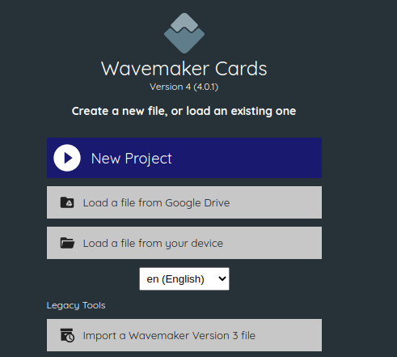
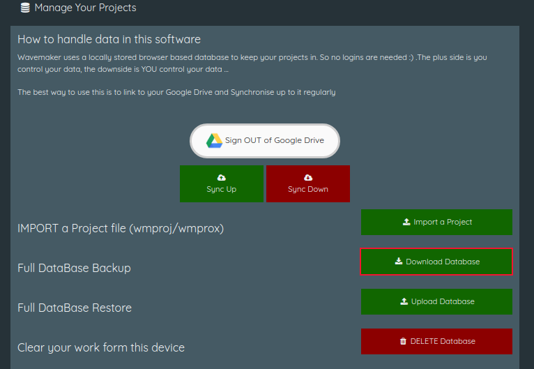

:doctype: book
:toc:
:toclevels: 1

= Getting started

When you load Wavemaker 4 for the first time, you will see a welcome screen that presents you with your options:

The documentation in this section will discuss these options in more detail.

== Creating a new project

If you choose the first option, *New project*, you will be taken to the 'Project Home' screen.

Here you can name your manuscript in the 'My Project Name' field.

Below the Project name field is a series of links to the Wavemaker tools.

You can return to the Project Home screen at any time by clicking the 'Home' icon in the top bar.

== Load a file from Google Drive

// tag::import-from-drive[]
If you have previously saved a Wavemaker 4 project in Google Drive, you can use this option to reload that project file into Wavemaker.

The file must have the `.WM4` or `.wm4` file extension to be recognised by Wavemaker.

[sidebar]
****
@Iain: Trying to connect Google Drive presents the following auth error:

----
Access blocked: This app's request is invalid

You can't sign in because this app sent an invalid request. You can try again later or contact the developer about this issue. Learn more about this error
If you are a developer of this app, see error details.
Error 400: redirect_uri_mismatch
----
****
// end::import-from-drive[]

== Load a file from your device

// tag::import-from-device[]
If you have previously saved a file to your local computer, you can use this option to reload it into Wavemaker.

The file must have the `.WM4` or `.wm4` file extension to be recognised by Wavemaker.
// end::import-from-device[]

== Choose a language

Wavemaker is currently available in 7 languages:

* Cymraeg (cy)
* Deutch (de)
* English (en)
* Español (es)
* Français (fr)
* Português (pt)
* Türkçe (tr)

If you wish to help translate Wavemaker into another language, contact ...

== Import a Wavemaker Version 3 file

// tag::import-wm-v3[]
If you are migrating from Wavemaker Version 3, you can use this one-time conversion tool to import a locally-saved Wavemaker 3 database into Wavemaker 4.

.To create a Wavemaker 3 database file:

. Log into Wavemaker version 3 at https://wavemaker.cards/

. Navigate to the main page if you are not there already.

. Under the 'Manage Your Projects' heading, click the green 'Download Database' button beside the 'Full Database Backup' option:
+

. In the download window, choose location and a name for your backup.
By default the name is `wavemaker-<HH-MM-DD-MM-YYYY>.wmdata` (where `HH-MM-DD-MM-YYYY` represents the time and date of the export).

.To import a Wavemaker 3 database file:

. Click the *Import a Wavemaker Version 3 file* option from the Project Home screen.

. Read the information presented on the next screen.

. Click the *Upload a wavemaker database* button.

. Navigate to, and select, the appropriate `.wmdata` file.

. Select which project you would like to import.

NOTE: If you have multiple projects in Wavemaker 3 that you would like to import into Wavemaker 4, you must repeat the above process for each project, saving each as a Wavemaker 4 `wm4` file (either locally or in Google Drive) before importing the next one.

[sidebar]
****
@Iain; I can't seem to get back to the welcome screen once I've imported a project unless I close that project (which clears it from the database).

Therefore I cannot import more than one project at a time, regardless of if I import them from `.wm4` or `.wmdata` files.
Is this intended or a bug?

Also, some of the projects in my `.wmdata` file simply refuse to import. I click on them in the presented list and nothing happens. This seems to happen with older projects. Re-opening in WM3, re-saving, re-exporting and re-importing into WM4 doesn't seem to make any difference.
****
// end::import-wm-v3[]
