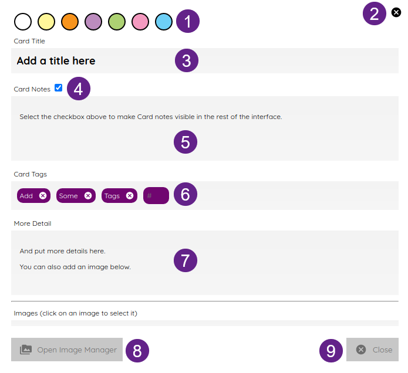

:doctype: book
:toc:
:toclevels: 1

= Writing your manuscript

The following sections will cover how to use Wavemaker to actually write your manuscript.

== Adding Chapters

You can create new sections/chapters in your manuscript using the sidebar on the left of the writing pane.

At the top of this sidebar you will find two buttons:  and image:../images/new-chapter-icon.png[New chapter,width=20,height=20].
Click on either of these icons to create the structure you want for your manuscript.
Each chapter and folder can be named as needed to ensure you know what it contains.

You can reorder the sections and folders by dragging the respective icon to the desired location.
You can also delete any section or folder by clicking on the `x` icon that becomes visible to the right when you hover your cursor over it.

Chapters can be grouped into folders and nested.
Add a folder by clicking the appropriate icon from the top of the bar.

== Adding text

The copy (text) that makes up your manuscript is typed into the xref:features.adoc#writer[Writer tool].

Access the writer tool directly by using the *My Books* icon (image:../images/manuscript-icon.png[My Books,width=20,height=20]) from the main menu bar.
Alternatively, you can access it from the *Project Home* page using the () icon and selecting *My Books* from the tools list.

The writer tool behaves just like any other word processor.
Text is typed into the large white pane that mimics a page of white paper.
The format of the text can be controlled by the icons in the bar at the top of the writing pane:

From left to right, the icons on this bar are:

. *Bold* text.
. _Italic_ text.
. [.line-through]#Strikethrough# text.
. [.underline]##@Iain: This doesn't appear to do anything.##
. Top-level heading.
. Subheading.
. Insert image.
. Bulleted list.
. Numbered list.
. xref:features.adoc#planning-boards[Planning boards] link.
. xref:features.adoc#typewriter-mode[Typewriter mode].
. xref:features.adoc#highlighter-mode[Highlighter mode].
. Exclude from the manuscript's word count.

== Adding Cards

The sidebar to the right of the writing pane displays any cards attached to the chapter currently open in the writer.

. Click on the  icon.

. Choose whether to create a new card or link an existing card.

.. Creating a new card will automatically link it to the chapter you are working on.

.. Linking an existing card will not break any links that that card may already have.
Cards can be linked to more than one chapter.

All the cards you create will be stored in the xref:navigation.adoc#my-cards[Cards database].
Cards created in one part of the software can appear in other parts of the software.

They can be coloured and tagged to assist with sorting and identification.

The image below shows the card interface:

. Choose a background colour for the card.
This can be useful if you want a visual distinction between card types.

. Close the card interface without saving the card.

. Add a title to your card.

. Select this option if you would like the content of the card visible without opening it.

. The main (text) content of the card.

. Add tags to your card to allow for filtering in the xref:navigation.adoc#my-cards[Cards database].

. Add extra details to your card.

. Add an image to your card.

. Close the card, saving it to the xref:navigation.adoc#my-cards[Cards database].

[#typewriter-mode]
== Typewriter mode

Typewriter mode is accessed through the Writer tool.
Click the 'typewriter' icon () in the top bar to enter Typewriter mode.

This mode aims to help you concentrate on your writing by removing as much of the Wavemaker UI as is practical.
All that remains visible is the Writer formatting bar.

While in Typewriter mode, your text is centred in the window and the font is changed to a typewriter-like style.

As you type, the text automatically rises so that your cursor, and your current work, are at a comfortable eye level.
Lines are double-spaced automatically.

Exit Typewriter mode by clicking on the `x` icon in the top right.

[#highlighter-mode]
== Highlighter mode

Clicking the 'highlighter' icon (image:../images/highlighter-mode-icon.png[Highlighterg mode,24]) in the Writer's main menu bar will reveal a palette of seven colours.

You can click on a colour from this palette and any text you type will be highlighted in that colour.

Alternatively, you can highlight existing text by selecting it and then clicking one of the highlight colours.

[sidebar]
****
@Iain: Some thoughts regarding the highlighter implementation:

. There's no visual indicator on the palette to show which, if any, highlighter is currently in use.
Sure, typing will reveal that, but that could require unnecessary keystrokes to see which highlighter is active.

. The positioning of the colour palette often triggers the Cards sidebar if it is in 'hide' mode.

. Unhighlighting requires carefully selecting the highlighted text and clicking the active colour button (see #1 above).
If the selection is not perfect, not only will the text not be returned to normal, any additional text will become highlighted.
Perhaps a 'white' colour option could be added, or just an 'unhighlight' button?
****

'''

xref:index.adoc[Home]