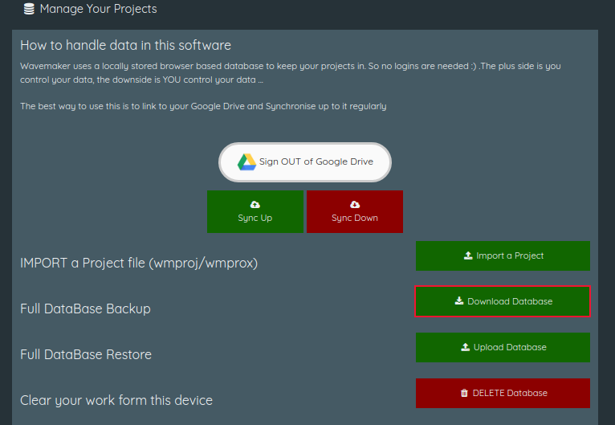
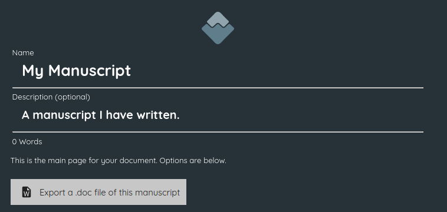

:doctype: book
:toc:
:toclevels: 1
:toc-title!:

= Backup, import and export

[#backup-to-drive]
== Backup to Google Drive

If you have not used this option before, clicking the  icon for the first time will open a dialogue box with a *pass:[[Login to Google Drive]]* button.

Clicking this button will open a dedicated browser window for you to log into Google Drive (if you are not already logged in) and authorise Wavemaker to make changes to your account.

This permission is required to save files to Drive.

[sidebar]
****
@Iain: I can't log into Google drive. I get the following error:

[WARNING]
====
Access blocked: This app's request
is invalid

pass:[*********@gmail.com]

You can't sign in because this app sent an invalid request. +
You can try again later or contact the developer about this issue. +
https://developers.google.com/identity/protocols/oauth2/javascript-implicit-flow#authorization-errors-origin-mismatch[Learn more about this error] +
If you are a developer of this app, see error details. +
`Error 400: redirect_uri_mismatch`
====

None of the following items about Google Drive have been tested due to the above error.
****

Once this permission has been granted, here are three ways you can use Google Drive to keep your work backed up and secure:

. Set Wavemaker to automatically sync your work to Drive as you write.
You will be prompted to enable this feature each time you load Wavemaker.
+
[sidebar]
****
@Iain: Is this still the case?
****

. You can manually sync to Google Drive whenever you choose.
Use the Google Drive icon in the menu bar () to initiate a backup.

. Use the <<Export to file>> instructions below to export your work, then save that file in a location backed up by Google Drive.

[#load-file-from-drive]
== Load a file from Google Drive

If you have previously saved a Wavemaker 4 project in Google Drive, you can use this option to reload that project file into Wavemaker.

The file must have the `.WM4` or `.wm4` file extension to be recognised by Wavemaker.

[#export-to-file]
== Export to file

Click the  icon to save the current project to your device.
The file will be in a Wavemaker-unique `.wm4` file.
The default naming convention for these files is the project name and the date and time of export in the following format:

[source.copy]
----
Name-of-Project[YYYY-MM-DD-HH-MM-SS].wm4
----

You can, of course, rename this file (do not alter the file extension) and save it in a location of your choosing.

[#load-file-from-device]
== Load a file from your Device

If you have previously saved a file to your local computer, you can use this option to reload it into Wavemaker.

The file must have the `.WM4` or `.wm4` file extension to be recognised by Wavemaker.

[#import-from-wm3]
== Import a Wavemaker Version 3 file

If you are migrating from Wavemaker Version 3, you can use this one-time conversion tool to import a locally-saved Wavemaker 3 database into Wavemaker 4.

.To create a Wavemaker 3 database file:

. Log into Wavemaker version 3 at https://wavemaker.cards/

. Navigate to the main page if you are not there already.

. Under the 'Manage Your Projects' heading, click the green 'Download Database' button beside the 'Full Database Backup' option:
+

. In the download window, choose location and a name for your backup.
By default the name is `wavemaker-<HH-MM-DD-MM-YYYY>.wmdata` (where `HH-MM-DD-MM-YYYY` represents the time and date of the export).

.To import a Wavemaker 3 database file:

. Click the *Import a Wavemaker Version 3 file* option from the Project Home screen.

. Read the information presented on the next screen.

. Click the *Upload a wavemaker database* button.

. Navigate to, and select, the appropriate `.wmdata` file.

. Select which project you would like to import.

NOTE: If you have multiple projects in Wavemaker 3 that you would like to import into Wavemaker 4, you must repeat the above process for each project, saving each as a Wavemaker 4 `wm4` file (either locally or in Google Drive) before importing the next one.

[sidebar]
****
@Iain; I can't seem to get back to the welcome screen once I've imported a project unless I close that project (which clears it from the database).

Therefore I cannot import more than one project at a time, regardless of if I import them from `.wm4` or `.wmdata` files.
Is this intended or a bug?

Also, some of the projects in my `.wmdata` file simply refuse to import. I click on them in the presented list and nothing happens. This seems to happen with older projects. Re-opening in WM3, re-saving, re-exporting and re-importing into WM4 doesn't seem to make any difference.
****

== Export a .doc file of this manuscript

This option, found on the main page of your manuscript, will export a `.doc` version of your work.

After clicking this button you will be prompted to name your exported file (be careful not to overwrite the `.doc` extension) and choose where on your local device to save it.

'''

xref:../index.adoc[Home]