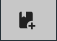
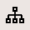
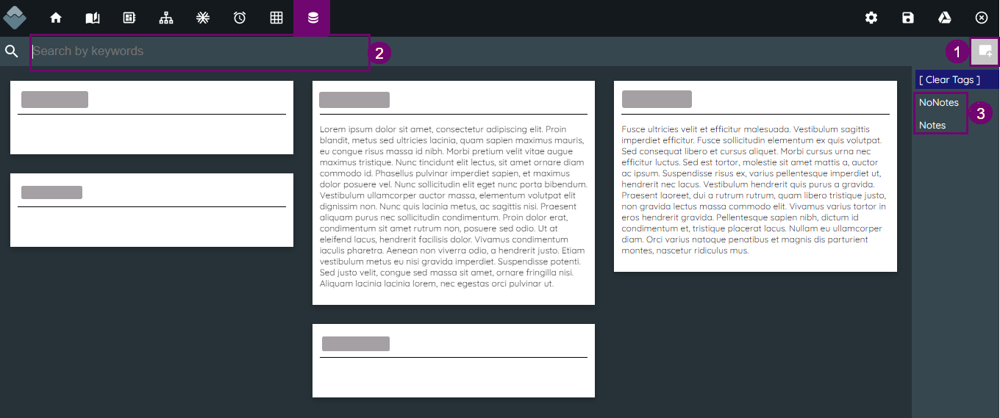
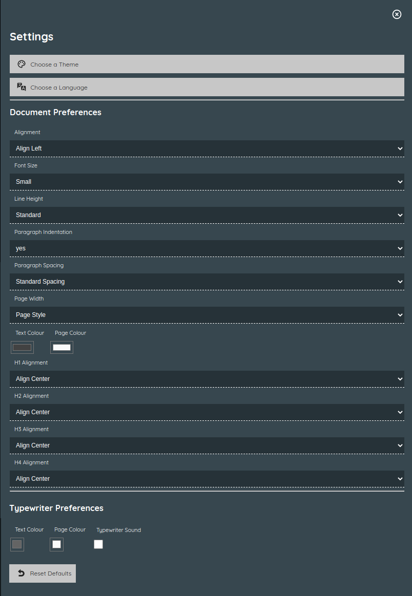
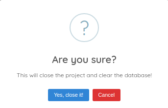

:doctype: book
:toc:
:toclevels: 1
:toc-title!:

= Navigation

[#menu-bar]
== Menu bar

At the top of every page in Wavemaker is the menu bar.

This bar is organised with links to writing tools to the left and software management tools to the right.

.Writing tools

. <<Wavemaker icon>>

. <<Project home>>

. <<My Books>>

. <<My Planning Boards>>

. <<My Mindmaps>>

. <<My Snowflakes>>

. <<My Timeline>>

. <<My Grid Planners>>

. <<My Cards>>

.Software tools

[start=10]
. <<Settings>>

. <<Save File>>

. <<Google Drive>>

. <<Close Project>>

[#wm-icon]
== Wavemaker icon

[sidebar]
****
@Iain; This doesn't seem to do anything.
****

[#project-home]
== Project home

Clicking on this icon will return you to the product home page.
Beneath the title of your project, you will find many of the same links that are on the main menu bar.

You can also use the Help button (image:../images/help-icon.png[Help,width=20,height=20]) to access this documentation.

[#my-books]
== My Books

This button is a link to a list of the projects you currently have saved in Wavemaker.

From this page, you can access or delete any project in the list or you can start a new project by using the 'New book' button: 

== My Planning Boards

This button will take you to a list of all the planning boards you have saved for the current project.

[sidebar]
****
@Iain: Am I supposed to be able to close a planning board and return to the previous (list) screen, or is there only ever one planning board active within any given project?
****

== My Mindmaps

This button will take you to a list of all the mindmaps you have saved for the current project.

You can access or delete any mindmap from the list, or use the  icon to add a new mindmap.

To create a new mindmap:

. Click on the 'New mindmap' icon.

. Enter a name for your mindmap.

. Click the `+` icon below the name field to add the new map to your list of mindmaps.

You can abort creating a new mindmap by clicking the 'New mindmap' icon again.

== My Snowflakes

This button will take you to a list of all the snowflakes you have saved for the current project.

You can access or delete any snowflake from the list, or use the  icon to add a new snowflake.

To create a new snowflake:

. Click on the 'New snowflake' icon.

. Enter a name for your snowflake.

. Click the `+` icon below the name field to add the new map to your list of snowflakes.

You can abort creating a new snowflake by clicking the 'New snowflake' icon again.

== My Timeline

This button will take you to a list of all the timelines you have saved for the current project.

You can access or delete any timeline from the list, or use the  icon to add a new timeline.

To create a new timeline:

. Click on the 'New timeline' icon.

. Enter a name for your timeline.

. Optionally, add a description for the timeline.

. Click the `+` icon below the name field to add the new map to your list of timelines.

You can abort creating a new timeline by clicking the 'New timeline' icon again.

== My Grid Planners

This button will take you to a list of all the grid planners you have saved for the current project.

You can access or delete any grid planner from the list, or use the  icon to add a new grid planner.

To create a new grid planner:

. Click on the 'New grid planner' icon.

. Enter a name for your grid planner.

. Click the `+` icon below the name field to add the new map to your list of grid planners.

You can abort creating a new grid planner by clicking the 'New grid planner' icon again.

[#my-cards]
== My Cards

Clicking this icon will take you to the Cards database.
Here you can see all the cards you have created for the manuscript you currently have open.

. Click this icon to create a new card.

. Use this box to search through your cards for keywords.

. Use tags (added during card creation) to filter out cards you don't need.

Read the xref:features.adoc#cards[Cards] section in the _Features_ chapter for an example of the card interface.

== Settings

Click the  to open a dialogue box that contains many settings with which you can control your experience with Wavemaker.

Review the image below to see the available options.

== Save File

Click this icon to save your manuscript locally (in a `.wm4` file format).

Read more in the xref:backup-import-export.adoc#export-to-file[Export to file] section.

[#google-drive]
== Google Drive

Click this icon to back-up your manuscript to Google Drive.

Read more in the xref:backup-import-export.adoc#backup-to-drive[Backup to Drive] section.

== Close Project

WARNING: *Potential data loss ahead! Please read the following carefully!*

This icon will close your current project and clear the database.

We strongly encourage you to have a backup of your project saved, either locally or in Google Drive, before using this option.

You will be prompted for confirmation before anything is deleted:

*This action can not be undone* and any data lost will not be recoverable unless you have a backup saved.

'''

xref:index.adoc[Home]